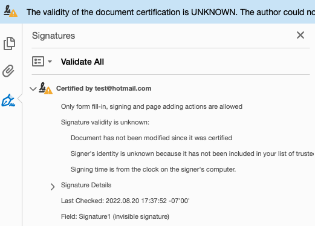

# Build A PDF Signing Service From Scratch

I was able to build a digital signature service early 2022. The service is basically a RESTful backend service that takes a PDF file as input in the API request and returns the signed file in the response. In this story, I will summarize the concepts and resources used in the development and also provide a step-by-step guide for building a PoC.

## Concepts
> A digital signature is a mathematical scheme for verifying the authenticity of digital messages or documents. (Wikipedia)

PDF signature is just one category of digital signature, so it serves the same purpose, helping you verify whether a PDF file has been changed since the signature is attached. The metadata in the signature also includes the signer information, the signing timestamp and so on.

This is what will happen when you sign a PDF file using tools like Adobe Reader or DocuSign:
1. The content of the PDF will be used as the input to generate a hash $H$.
2. A private key $\alpha$ stored in your system will be used to encrypt the hash, the encryption result will be $H_\alpha$.
3. Then, the corresponding public key $\beta$ plus the signing metadata are put into a CSR (Certificate Sign Request), and sent to a public CA (Certificate Authority).
4. The public CA signs the CSR using its own private key and returns the result (CSR + signed CSR) as a certificate $Cert$.
5. $Cert$ along with $H_\alpha$ will be embedded to the PDF file as a signature.

Cool, so you have a signed PDF right now. Then you send it to your friend Chen and tells him to verify the PDF. Chen opens the PDF file using Adobe Reader and this is what will happen:
1. $Cert$ and $H_\alpha$ are extracted from the PDF.
2. The $Cert$ will be validated first. The public CA can easily verify $Cert$ by decrypting the signed CSR inside $Cert$ using its public key and comparing it with the original CSR. If they match, it means key $\beta$ and the signing metadata are verified and can be trusted.
3. Since we have a verified public key $\beta$ now, we decrypt $H_\alpha$ using $\beta$ and get $H$.
4. Hash the PDF file again and let's say the result is $H'$. If $H'$ is the same as $H$, it's safe to say the PDF file hasn't been changed since the signing.

Some details are skipped here for simplification. Check section # if you're interested.
1. chain 2. signs the CSR with the private key of the asymmetric keypair

## Build PoC using AWS KMS
It's easy to use the asynmmetric key pair stored in your system to generate a PDF signature. However, it's not a good idea to use them in real production. You have to maunally (or think of a way to) create, rotate the keys. You also need to make your system as secure as possible because you don't want someone to break-in and stole your private key. 

In this guide, we will use AWS KMS as our asynmmetric keys and build a working example.

### Step 1. Create your asymmetric key pair in AWS
Follow the AWS guide to create your own asymmetric key pair in aws console. [This](https://docs.aws.amazon.com/kms/latest/developerguide/symmetric-asymmetric.html) is one post I found on google. In this guide, I use "RSA_2048" as the Key Spec and "Sign and verify" as Key Usage.

### Step 2. Generate a CSR for your public key
Follow this [repo](https://github.com/g-a-d/aws-kms-sign-csr) to create a CSR using your KMS pair. Follow the "RSA" one. As the result, you should have a CSR called `new.csr`.

### Step 3. Get the Cert from a third-party tool
Now we need to request a public CA to sign the CSR. Here I will use a free webiste [8gwifi.org](https://8gwifi.org/signcsr.jsp) I found from Google. Paste the content of `new.csr` into the box, select "Use Site Private Key" and click "Submit". The result will be in a box below in the PEM format. Copy the content and paste into a file, let's call it "cert.pem".

### Step 4. Sign your Pdf using the cert and AWS
Clone this repo and open it using Intellij (create a project using existing files). Replace the pem file in the resource folder with your own. Change the kmsKeyId in `CreateSignatureExample.java`. Now you need to set the aws region to use. You can follow this [guide](https://docs.aws.amazon.com/sdk-for-java/v1/developer-guide/setup-credentials.html), the `region` should be where you kms key is created. After this, change the outfile path in the `main` method to where ever you want.

Great, now you can run the `main` method in `CreateSignatureExample.java`. It signs the `dummy.pdf` provided and saves `dummy_signed.pdf` to the output path.

**What happened inside the java project?** The java project generates the hash of the pdf, signs it using KMS api. The signed hash + the cert you provided is the acutal signature. Finally, signature is attached to the pdf, and bang!! your signed pdf is there.

### Step 5. Verify the signature
You can verify the signature inside `dummy_signed.pdf`. For example, if you open it with Adobe Reader, open the signture panel, you can see all the information related to the signature. 

Ideally, it should display a yellow Exclamation mark saying `The validity of the document certification is UNKNOWN` and also `Document has not been modified since it was certified`. It basically means the signature itself is valid, however, the cert can not be verified. This makes sense since we're signing the CSR using `8gwifi.org` which it's not a public CA.

If you see a red mark in Adobe Reader, bad news, your signature is not valid.

If you were able to sign your CSR using a real public CA, green mark will show up in the panel, congrats! everything is perfect now.

## Resources
- [Generate CSR for AWS KMS](https://github.com/g-a-d/aws-kms-sign-csr)
- [AWSKMSContentSigner Reference](https://stackoverflow.com/questions/64867778/sign-a-pdfdocument-using-the-digital-signature-returned-by-aws-kms)
